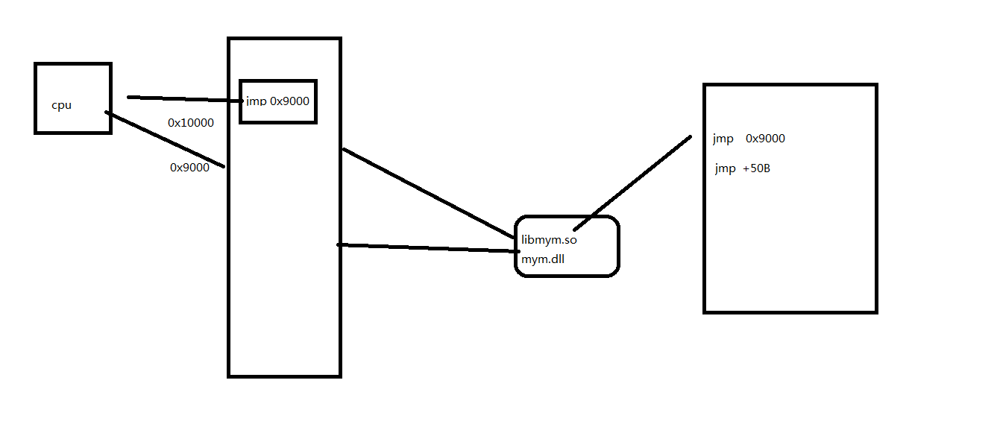
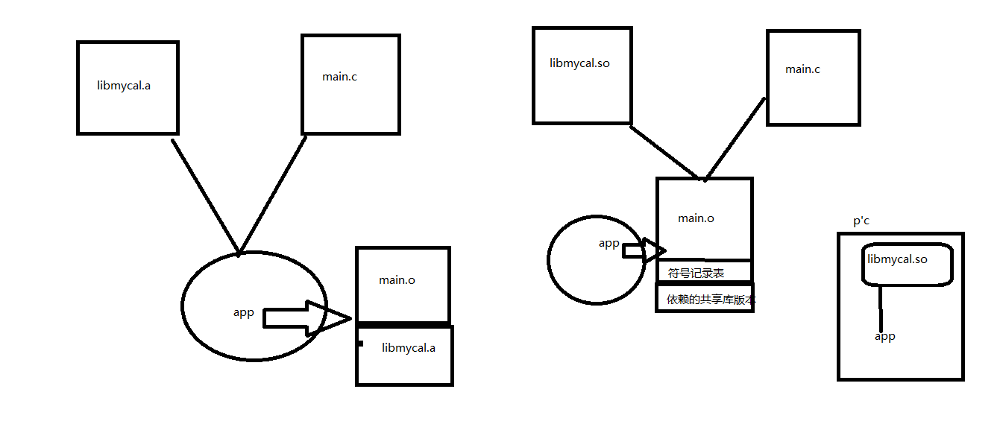

# share_lib
生成动态库和静态库的步骤

## dynamic_lib
	$ gcc -fPIC -c common.c //生成.o文件
	$ gcc -shared -Wl,-soname,libmy.so.1 -o libmy.so.1.0.1 common.o //生成libmy.so.1.0.1共享库
	$ ln -s libmy.so.1.0.1 libmy.so
	$ gcc main.c libmy.so -o app //生成程序app
	$ ldd app //查看app所依赖库,检测app需依赖的动态库
	$ sudo vim /etc/ld.so.conf //添加共享库libmy.so.1.0.1文件夹地址，如~/Desktop/linux/share_lib
	$ sudo ldconfig -v //更新库
	$ ldd app
	$ ./app

## static_lib
	$ gcc -fPIC -c common.c
	$ ar rcs libmy.a common.o //生成静态库libmy.a
	$ nm libmy.a //查看libmy.a里的*.o的文件
	$ gcc main.c libmy.a -o app
	$ ./app

## Description

- realname -> libmy.so.1.0.1

- so name  -> libmy.so.1

- link name-> libmy.so

共享库寻址

共享库命名

共享库静态库工作关系

