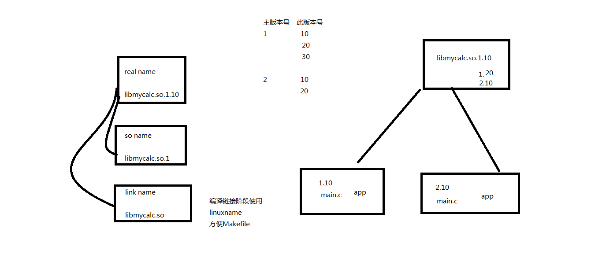

#share_lib
生成共享库步骤
#Example
	$ gcc -fPIC -c common.c //生成.o文件
	$ gcc -shared -Wl,-soname,libmy.so.1 -o libmy.so.1.0.1 common.o //生成libmy.so.1.0.1共享库
	$ gcc main.c libmy.so.1.0.1 -o app //生成程序app
	$ ldd app //查看app所依赖库
	$ sudo vim /etc/ld.so.conf //添加共享库libmy.so.1.0.1文件夹地址，如~/Desktop/linux/share_lib
	$ sudo ldconfig -v //更新库
	$ ldd app
	$ ./app
	$ ln -s libmy.so.1.0.1 libmy.so
#Description
​	realname -> libmy.so.1.0.1
​	so name  -> libmy.so.1
​	link name-> libmy.so

​	共享库命名

